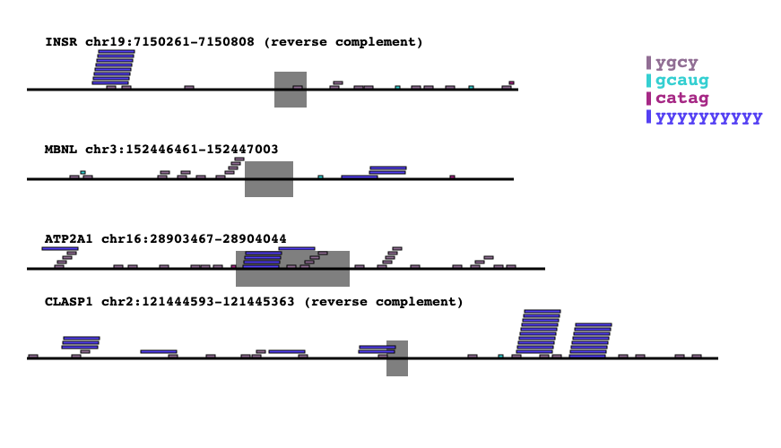

# Motif Mark using Cairo
## Introduction

Motif Mark is a tool that will visually represent motifs on a gene (introns/exons). We
utilize the power of PyCairo and create 1:1 realistic representations of the gene and 
location of the motifs. Written in Python 3.9.


## Set Up

You will need PyCairo installed to make this work. We have made it easy to install the 
dependencies if you have conda installed on your computer already. Just follow the command
below if you are within the repository directory directly. Then you are good to go!

```
conda create --name <desired-env-name> -f env_cairo.yml
conda activate <desired-env-name>
```


## Parameters

There are two parameters/files you that have to supply to the tool in order for it to work.

1. A **fasta file** with your intron/exons, one exon per fasta line. 
2. Also, you will need to supply a **motif file**. Which can be a text file, however, what is necessary 
is that each motif is on a newline. Like the example below.

Motif Example:

```
ygcy
GCAUG
catag
YYYYYYYYYYY
```

When calling the python file you can do it as below:

```
python motif-mark-oopy.py -f <fasta file> -m <motif file>
```

You can see that you supply the fasta file with `-f` and the motif file with `-m`. 

We advise that you run only 5-10 genes per run. As the picture will be fairly large. Also, it is important to note that if you supply too many Motifs that it may overlap with some of the longer Introns. We would 
advise to use around 5-10 Motifs at a time as well. If you need to do more that is fine. Just be 
aware of the keys display.


This will output a .png file that has the same name as the file passed in the `-f` parameter. This
outputted .png will be in the same folder as this cloned repository.


## Output

This is what you should expect to see:

- Long Black Lines are Introns
- Large Opaque Blocks are Exons
- Then there is a key to associate what motif goes with which small colored box


